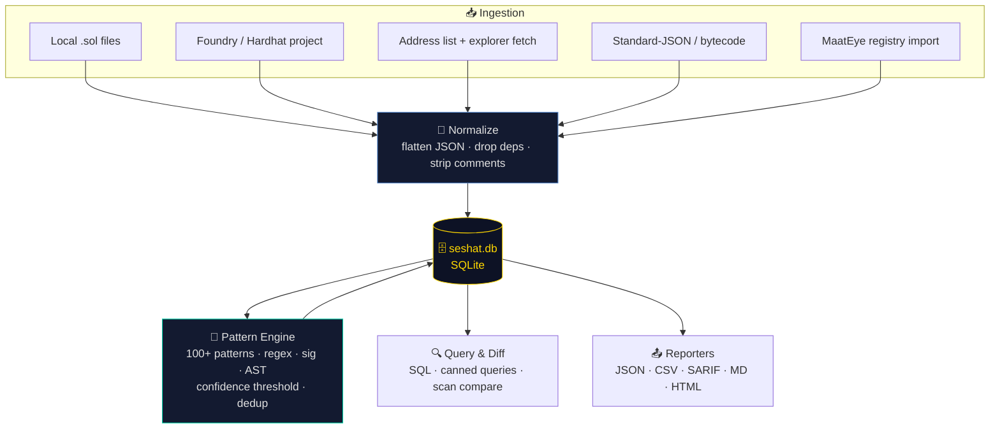

<div align="center">

# 📜 Seshat

### The Divine Scribe of Smart Contracts

*She who measures, records, and remembers — an **offline-first** smart-contract vulnerability **archive & scanner** that builds a local database you own.*

<p align="center">
  
  
  
  
  
  
</p>

<p align="center"></p>

<p align="center">
  <b>🏛️ Named after Seshat (𓋇)</b> — ancient Egyptian goddess of writing, wisdom, measurement,<br>
  and the divine record-keeper: <i>"Mistress of the House of Books."</i><br>
  <i>Where <a href="https://github.com/Lord1Egypt/MaatEye">MaatEye</a> is the all-seeing eye that judges in the cloud,<br>Seshat is the scribe who records every contract and verdict into an archive that is yours.</i>
</p>

</div>

---

## 🌍 Vision

**Seshat is a smart-contract vulnerability scanner you download and run on your own machine.** No GitHub Actions. No cloud. No API gatekeeping. It ingests contracts from anywhere, scans them with **100+ detection patterns**, and writes everything — source, scans, findings, history — into a **local SQLite database** you can query, diff, and export, fully offline.

It is built for people who want to **own their data and their analysis**: auditors triaging a portfolio, researchers building a corpus, teams gating CI without sending source to a third party, and anyone who believes a security tool should work on a plane with the Wi-Fi off.

> 🔎 **Honest by design.** Like its sibling MaatEye, Seshat reports **review flags** — heuristic pattern matches that point a human to code worth inspecting — **not confirmed vulnerabilities**. A flag means *"look here,"* not *"this is exploitable."* That honesty is baked into the schema, the severities, and every report.

---

## ✨ What makes Seshat different

| | 📜 **Seshat** | 👁️⚖️ MaatEye | 🔬 Typical scanners |
|---|:---:|:---:|:---:|
| **Runs locally / offline** | ✅ download & run | ❌ cloud (GitHub Actions) | ⚠️ varies |
| **Owns a local database** | ✅ SQLite, queryable | ❌ JSON registry | ❌ stateless |
| **Detection patterns** | ✅ **103** | 50 | 30–90 |
| **Ingests local projects** | ✅ foundry/hardhat/.sol | ❌ tokens only | ✅ |
| **Scan history & diffing** | ✅ compare runs | ❌ | ⚠️ rare |
| **SARIF / IDE export** | ✅ SARIF 2.1.0 | ❌ | ⚠️ some |
| **Zero-/low-dependency** | ✅ stdlib + sqlite3 | ✅ | ❌ heavy deps |
| **Sends your source anywhere** | ❌ never | ⚠️ explorer fetch | ⚠️ varies |

---

## 🧩 Core features

- 🗄️ **Local vulnerability database** — every contract, its source, every scan, and every finding live in `seshat.db`. Re-openable, queryable with plain SQL, and 100% offline.
- 🎯 **100+ detection patterns** — a SWC/CWE-mapped taxonomy across access control, reentrancy, arithmetic, proxies, oracles, governance, token economics, signatures, and more — each with a confidence score and labeled test fixtures.
- 📥 **Ingest from anywhere** — local `.sol` files, Solidity Standard-JSON, Foundry/Hardhat projects, a list of addresses (fetched once, cached forever), raw bytecode, or import an existing MaatEye registry.
- 🧪 **Honest, deduplicated findings** — flatten Standard-JSON (and Etherscan's `{{…}}`), drop bundled dependencies, strip comments/strings, dedup per `(pattern, line)`, and threshold by confidence — so the numbers mean something.
- 🔁 **Scan diffing** — compare two scans of the same corpus: what's new, what's fixed, what regressed.
- 📤 **Export everywhere** — JSON, CSV, **SARIF** (for VS Code / CI annotations), Markdown, and a self-contained offline **HTML report** you can open in any browser.
- ⚡ **Optional Rust core** — a later phase adds a parallel Rust scanning engine for large corpora, keeping the Python front-end ergonomic.

---

## 🏗️ Architecture at a glance



Detailed design lives in **[docs/ARCHITECTURE.md](docs/ARCHITECTURE.md)**, the schema in **[docs/DATABASE_SCHEMA.md](docs/DATABASE_SCHEMA.md)**, and the pattern taxonomy in **[docs/PATTERNS.md](docs/PATTERNS.md)**.

---

## 🚀 Quick start

```bash
# Install — pure Python, zero runtime dependencies, patterns bundled in
pipx install seshat-scanner       # or: pip install seshat-scanner
# (or grab a standalone binary from the GitHub Releases — no runtime needed)

# Build a local archive from a project (deps auto-excluded), then scan
seshat init
seshat ingest ./my-foundry-project
seshat scan                       # runs all 103 patterns into seshat.db

# Read the results — fully offline
seshat report                     # pretty terminal triage view
seshat report -o report.html      # self-contained offline HTML
seshat report -o findings.sarif   # SARIF for VS Code / CI annotations

# Ask the archive questions
seshat query --canned by-severity
seshat query "SELECT pattern_id, COUNT(*) n FROM findings GROUP BY 1 ORDER BY n DESC"
seshat search "delegatecall"      # full-text search over stored source

# Re-scan only what changed, then see the delta
seshat scan --incremental
seshat diff 1 2                   # new / fixed / regressed

# Ingest by address (fetched once with --online, then cached forever)
seshat ingest --address 0xA0b8... --chain ethereum --online
```

Everything above runs with **no network** (the one exception is an explicit
`--online` address fetch, which then caches). `seshat --help` lists every command.

---

## 🗺️ Roadmap

Seshat ships in eight focused phases. Full detail + acceptance criteria in **[ROADMAP.md](ROADMAP.md)**; per-phase task lists in **[CHECKLIST.md](CHECKLIST.md)**.

| Phase | Theme | Outcome |
|:---:|---|---|
| **0** | 🏛️ Foundation & schema | Repo, CI, SQLite schema + migrations |
| **1** | 📥 Ingestion engine | Import & normalize from every source |
| **2** | 🎯 Pattern engine (100+) | Matchers, pattern SDK, labeled fixtures |
| **3** | 🗄️ Local DB & query | Persist, SQL/canned queries, scan diff |
| **4** | 📤 Reporting & UX | JSON/CSV/SARIF/MD/HTML, pretty CLI/TUI |
| **5** | ⚡ Rust performance core | Parallel engine for large corpora |
| **6** | 📦 Distribution | PyPI · binaries · demo |
| **7** | 🧠 Ecosystem | Plugins · IDE/SARIF · interop |

**Current status:** ✅ Phases **0–4 shipped** (schema · ingestion · 103-pattern engine · query/diff/incremental · reporting) and 📦 **Phase 6 distribution** in progress. Phase 5 (Rust) is optional/perf-only.

---

## 📜 Philosophy

> *Seshat recorded the deeds; Ma'at weighed them against the feather.*

Truth over flattery. A flag is an invitation to look, not a verdict. The archive is yours, it works offline, and it tells you exactly how confident it is. Read more in **[ABOUT.md](ABOUT.md)**.

---

## 🤝 Contributing & License

This is an early-stage, design-first project by **[Lord1Egypt](https://github.com/Lord1Egypt)**. Issues, pattern ideas, and architecture feedback are welcome while the foundation is being laid. Licensed under **[MIT](LICENSE)** — free for everyone, forever.

<div align="center">
<br>
<i>📜 May every contract be measured, recorded, and remembered. 📜</i>
</div>
